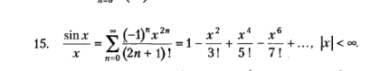

# Лабораторная работа №1
## Основы функционального программирования в Scala
### Задание
Написать скрипт, вычисляющий и выводящий в консоль в виде
таблицы значения функции, заданной с помощью ряда Тейлора на
интервале от Хнач до Хкон с шагом dx с точностью e. Таблицу
снабдить заголовком.

Пример вывода ( Хнач= -0,9; Хко = -0,4; dx = 0,1; e = 0,000001):
 * x f(x) Taylor(x) TI (Taylor Iterations)
 * -0,90 -2,3025850930 -2,3025763861 88
 * -0,80 -1,6094379124 -1,6094334357 44
 * -0,70 -1,2039728043 -1,2039704656 29
 * -0,60 -0,9162907319 -0,9162893233 21
 * -0,50 -0,6931471806 -0,6931453746 15
 * -0,40 -0,5108256238 -0,5108248011 12

Входные параметры скрипта: Хнач, Хкон, dx, e - числа с плавающей запятой.\
Для форматирования вывода использовать метод formatted
или аналогичные способы.\
Запрещается использовать var-переменные в явном или
неявном виде и циклы со счетчиком (придерживаться
функционального стиля разработки).\
Необходимо осуществить проверку на адекватность значений
перед расчетом (конечное значение должно быть достижимо при
заданном шаге и начальном значении, ошибка больше нуля,
конечные и начальные значения укладываются в условия по
варианту).\
Не забыть, что ошибка (отклонение) рассчитывается как
абсолютное значение.
\
_Аппроксимируемая функция_